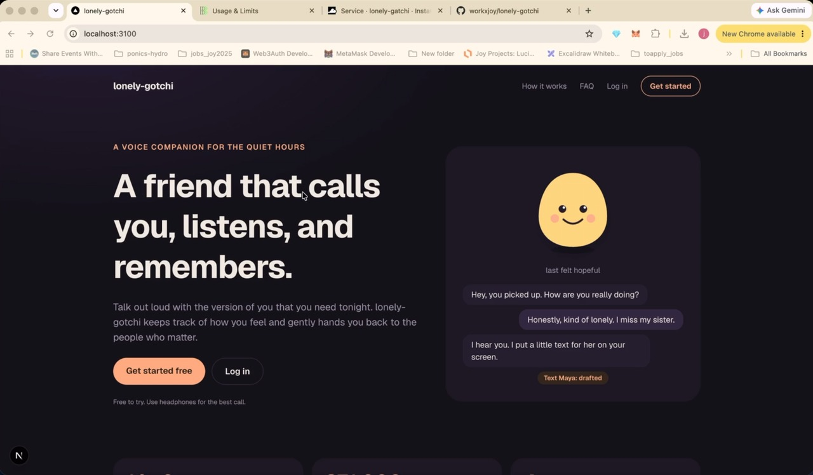
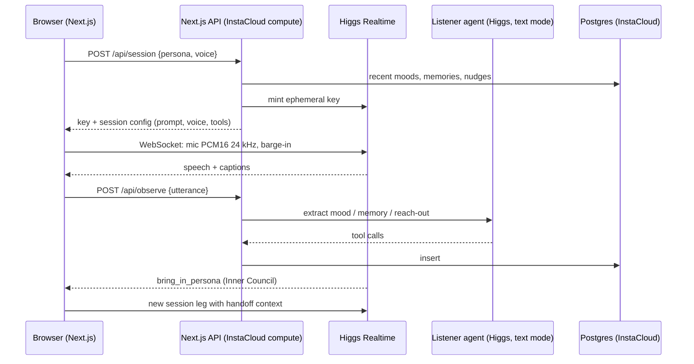

# lonely-gotchi

**A voice companion that calls you, listens, remembers, and hands you back to the people who matter.**

Loneliness affects 1 in 6 people worldwide and is linked to more than 871,000 deaths a year ([WHO, 2025](https://www.who.int/news/item/30-06-2025-social-connection-linked-to-improved-heath-and-reduced-risk-of-early-death)). Affirmation apps send generic quotes; they don't listen, don't remember, and don't talk back. lonely-gotchi is a live voice call with the version of you that you need tonight, and it is designed to nudge you toward real people instead of replacing them.

## Demo video

[](https://drive.google.com/file/d/1rAPovzt3G32v7Zqf7m_A5C5Eugk6jDt6/view?usp=sharing)

**[Watch the demo on Google Drive (3 min)](https://drive.google.com/file/d/1rAPovzt3G32v7Zqf7m_A5C5Eugk6jDt6/view?usp=sharing)** (also in the repo: [`docs/demo/lonely-gotchi-demo.mp4`](docs/demo/lonely-gotchi-demo.mp4)): sign up, call a companion with a lip-synced avatar greeting, talk and interrupt, Inner Council handoff, Hindi, and the dashboard.

Built in one day at *Build an AI Startup in One Day* with **Boson AI Higgs** (Realtime, Avatar, TTS, STT) and **InstaCloud**.

## Team

| Name | GitHub |
| --- | --- |
| Cristina McComic | [@CrMcComic](https://github.com/CrMcComic) |
| Drew Brosnan | |
| Joy S | [@workxjoy](https://github.com/workxjoy) |

## Submission

| | |
| --- | --- |
| Project | lonely-gotchi |
| One-liner | A voice companion that calls you, listens, remembers, and hands you back to the people who matter. |
| Tracks | Weird and Wonderful, Breaking the Language Barrier, Best use of InsForge |
| Repository | [github.com/workxjoy/lonely-gotchi](https://github.com/workxjoy/lonely-gotchi) |
| Demo video | [Google Drive](https://drive.google.com/file/d/1rAPovzt3G32v7Zqf7m_A5C5Eugk6jDt6/view?usp=sharing) |
| Built with | Boson AI Higgs Realtime, STT, TTS, create-voice, Avatar; InstaCloud Postgres; Next.js 16; Better Auth |

## What it does

| Agent | Role |
| --- | --- |
| **Voice agent** | The companion you talk to: Loving Partner (Ethan), Sassy Best Friend (Nora), or Fairy Godmother (a custom voice built with the Higgs create-voice API). Live speech-to-speech, interruptible mid-sentence, follows your language. |
| **Listener agent** | Silent, runs beside the call. Reads each thing you say and records your mood, memories, and reach-out drafts. |
| **Bridge agent** | When you mention someone you miss, drafts a warm text to them ("Text Maya" card with a Copy button). The companion asks next call whether you sent it. |
| **Summarizer agent** | When a call ends, stores the full transcript as a call log, writes a summary, notes **what helped**, and saves new facts. The next call's prompt includes it: the app learns what works for each user. |
| **Inner Council** | A companion can hand the call to another ("Let me bring in your Sassy Best Friend"). The call continues with full context. |

Also:
- **Accounts**: email and password sign-up with Better Auth; users, hashed passwords and sessions live in InstaCloud Postgres. Every mood, memory and reach-out draft belongs to the signed-in user.
- **SaaS layout**: sidebar navigation with **Call** and **Dashboard**; the dashboard shows check-in stats, a mood chart, memories, drafts and full history.
- **Avatar greeting**: each call opens with a lip-synced Higgs Avatar clip, then the face stays on screen during the live call.
- **Memory across calls**: the next call opens by referencing what you shared before.
- **Push to talk or hands-free**: tap once to talk and again to send (or hold the button or Space), which is reliable in noisy rooms, or talk hands-free with natural turn-taking and barge-in. Typed messages also get spoken replies.
- **Automatic language following**: in Auto mode the app detects Hindi (Devanagari) in what you say and switches the companion's language mid-call; one unclear phrase can't flip it. Speech-to-text is hinted to English or Hindi so unclear audio isn't misheard as another language. Boson rejects mid-call system messages, so the switch is a `session.update`.
- **Gotchi**: a little face whose color and expression follow your latest mood, next to a mood timeline.
- **Hindi + Hinglish**: a language switch (Auto, English, हिन्दी). Hindi mode sends a Hindi hint to Higgs STT, tells the companion to speak Hindi, plays Hindi avatar greetings, and renders captions in Noto Sans Devanagari. Auto mode follows the user, including mid-sentence code-switching.
- **Abuse cut-off**: every utterance (spoken transcript or typed) is checked against an English, romanized-Hindi and Devanagari abuse list. On a match the reply is cancelled, the call ends with an on-screen alert, the words are masked in captions and the call log, and nothing is sent to the Listener (the server enforces the same check). Boson Realtime has no built-in moderation; its docs point to input transcripts for this.
- **Safety**: if self-harm comes up, it points to 988 (US) or local emergency services. It is a companion, not a therapist.

## Demo flow (3 minutes)

1. Open the landing page, **Get started**, and create an account (name, email, password).
2. Pick **Loving Partner** (Ethan's voice) and press **Call**. The avatar greets you.
3. Say: *"I've been feeling lonely this week. I miss my sister Maya."* Mood and memory land on the timeline, the gotchi changes, and a **Text Maya** card appears.
4. Talk over it mid-sentence: it stops instantly.
5. Say: *"I need someone to be real with me. Can I talk to my Sassy Best Friend?"* The Inner Council hands off.
6. Hang up and **Call again**: it asks whether you texted Maya.

## Architecture



## Boson AI APIs used

Every conversation runs on [Boson AI](https://www.boson.ai/) Higgs models ([docs](https://docs.boson.ai)).

| Boson API | Model | What lonely-gotchi uses it for | Code |
| --- | --- | --- | --- |
| Realtime WebSocket `wss://api.boson.ai/v1/realtime` | `higgs-realtime` | The live voice call: speech-to-speech, server VAD with barge-in, push-to-talk manual turns, tool calling for the Inner Council handoff, mid-call `session.update` for language switching, exact token usage per reply | `src/features/call/useRealtimeCall.ts` |
| Realtime client secrets `POST /v1/realtime/client_secrets` | | Short-lived `bai-eph-` keys so the browser connects directly while the API key stays on the server | `src/server/boson/client.ts` |
| Realtime in text mode (server side) | `higgs-realtime` | The Listener agent (mood, memories, reach-out drafts per utterance) and the Summarizer agent (call summary, what helped, new facts) | `src/server/boson/realtime-text.ts`, `src/server/companion/` |
| Input transcription | `higgs-stt-3.1` | Live captions, Listener input, abuse detection, language detection (English and Hindi hints) | `src/app/api/session/route.ts` |
| Voices `POST /v1/audio/voices` | | The Fairy Godmother's custom voice, cloned from a consented family recording | `scripts/create-voice.mjs` |
| Videos `POST /v1/videos`, `GET /v1/videos/{id}`, `GET /v1/videos/{id}/content` | `higgs-avatar` + `higgs-tts-3` (`input_tts`) | Lip-synced greeting clips (English and Hindi) and talking loops for each companion | `scripts/render-greetings.mjs` |

Voices: Ethan and Nora presets plus one custom clone. Languages: English, Hindi, and Hinglish code-switching.

## InstaCloud usage

The backend runs on [InstaCloud](https://www.instacloud.com/) by InsForge.

| What | How |
| --- | --- |
| Managed Postgres 16 (`db` service, us-east) | All app data: Better Auth users, sessions and accounts; moods, memories, nudges; call logs, transcripts and token usage |
| Tracked migrations | 5 SQL files in `migrations/`, applied with `insta run -- npm run db:migrate` (applied files recorded in `schema_migrations`) |
| Runtime secrets | `insta run -- npm run dev` injects `DATABASE_URL` into the process only; nothing is written to disk |
| Agent-governed setup | `insta setup agent` linked the repo to the project with a project-scoped agent session and a credential audit hook; the coding agent provisioned the database through the `insta` CLI |
| Scale-to-zero aware | Postgres pools drop idle clients after 10 s and handle dropped connections without crashing |
| Deploy target | The production build passes; the app is ready for InstaCloud compute (`insta deploy`) once the API keys are stored as InstaCloud secrets |

## Project structure

```
src/
  app/                 routes only (thin)
    page.tsx           landing page (public)
    (auth)/login       sign in (public; signed-in users go to /app)
    (auth)/signup      create account
    app/layout.tsx     protected shell: sidebar + account, redirects to /login
    app/page.tsx       Call: the companion
    app/dashboard      Dashboard: stats, mood chart, memories, drafts, history
    api/auth           Better Auth handler
    api/session        mint ephemeral key + build the voice session
    api/observe        run the Listener agent on one utterance
    api/moods          timeline feed
  server/              server modules
    auth.ts            Better Auth config (email + password, Postgres sessions)
    session.ts         getCurrentUser / requireUser / userFromRequest
    boson/             Realtime client secrets, one-shot text turns
    companion/         prompt builder, tools, Listener agent
    db/                pg pool + repositories (moods, memories, nudges)
  features/call/       useRealtimeCall hook, mic worklet, PCM player
  features/timeline/   mood feed hook
  components/          UI (AvatarStage, CallPanel, Gotchi, pickers, timeline)
  shared/              personas, voices, mood types (client + server)
migrations/            SQL, applied by scripts/migrate.mjs
scripts/               migrations, avatar rendering, end-to-end smoke tests
```

## Run it locally

Requirements: Node 20+, a Boson API key, and the InstaCloud CLI (`insta`) linked to a project with a Postgres service.

```bash
npm install
cp .env.example .env.local          # then set BOSON_API_KEY and BETTER_AUTH_SECRET (gitignored, never committed)
insta run -- npm run db:migrate     # create tables
npm run avatars:render              # optional: re-render greeting clips from public/avatars/<persona>.jpg
npm run voice:create -- mom.m4a fairy-godmother   # optional: custom voice from a consented recording
insta run -- npm run dev            # http://localhost:3100
```

Use Chrome and headphones.

**Custom voices in one command.** `voice:create` converts any recording (m4a, mp3, wav...) to 24 kHz mono, trims it to 30 s, transcribes it with Higgs STT, registers it with `POST /v1/audio/voices`, stores the new `voice_id` as `VOICE_<PERSONA_ID>` in `.env.local` (personal voice clones never go in the repo), and re-renders that persona's avatar clips.

**Checks** (with the dev server running; they sign in a dedicated smoke-test account):

```bash
npm run smoke:realtime              # voice session + Listener, text driven
node scripts/smoke-council.mjs      # Bridge draft + Inner Council handoff end to end
node scripts/smoke-learning.mjs     # call log -> summary + what helped -> next call remembers
npx tsc --noEmit && npm run lint
```

## Security notes

- API keys live only in `.env.local` (gitignored) or as InstaCloud secrets. The browser only ever receives short-lived Boson ephemeral keys.
- `/api/session` and `/api/observe` are rate limited per IP to protect the Boson balance.
- Pages under `/app` and every API route require a Better Auth session; data is scoped to the signed-in user.

## Credits

Avatar faces: all three personas use photos of the team's friends and family, with their permission; those files are kept out of the repo. A fresh clone falls back to `public/avatars/default-face.jpg`, Boson AI's sample avatar image from their documentation. All clips are rendered with Higgs Avatar and carry Boson's "generated by AI" label. Loneliness statistics: WHO Commission on Social Connection (2025).
